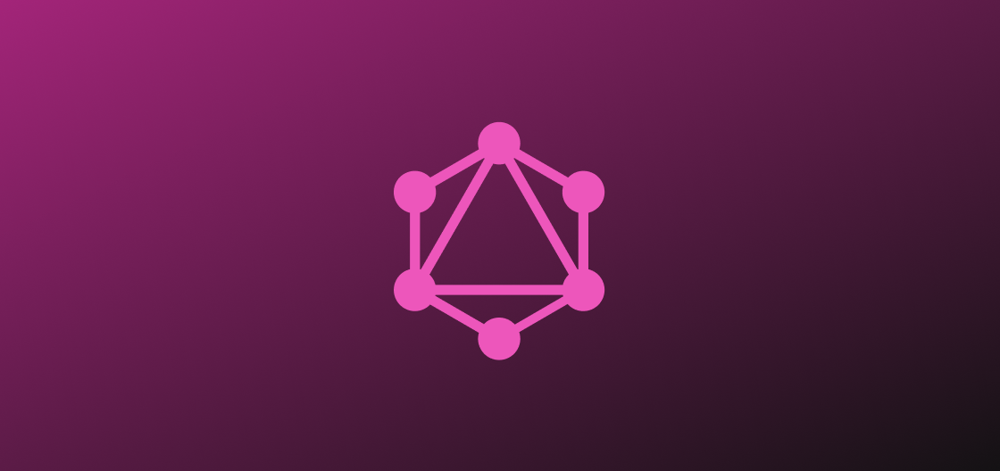
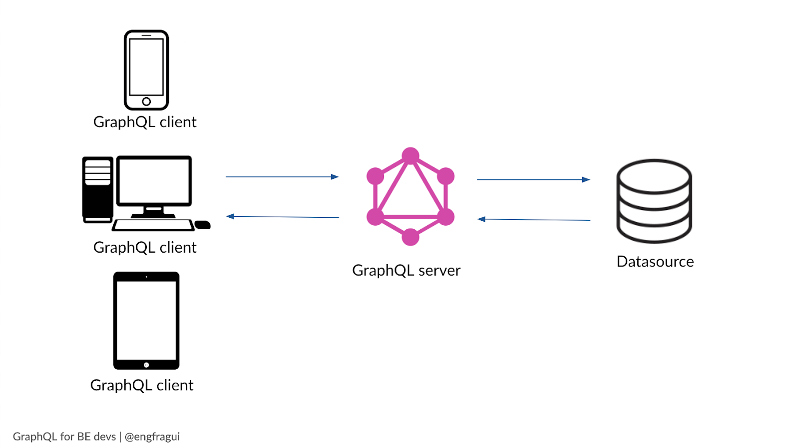

<div align="center" id="top"> 
  

&#xa0;

</div>

<h1 align="center">Fundamentos Graph Ql</h1>

<p align="center">
  

  

  

  
  
</p>

<p align="center">
  <a href="#dart-about">About</a> &#xa0; | &#xa0; 
  <a href="#sparkles-features">Features</a> &#xa0; | &#xa0;
  <a href="#rocket-technologies">Technologies</a> &#xa0; | &#xa0;
  <a href="#white_check_mark-requirements">Requirements</a> &#xa0; | &#xa0;
  <a href="#checkered_flag-starting">Starting</a> &#xa0; | &#xa0;
  <a href="#memo-license">License</a> &#xa0; | &#xa0;
  <a href="https://github.com/wsasouza" target="_blank">Author</a>
</p>

<br>

## :dart: About

GraphQL é uma linguagem de consulta (query language) para tornar APIs mais rápidas, flexíveis e intuitivas, principalmente no quesito gestão de dados entre front e backend.
Em resumo, isto é GraphQL: uma técnica de programação que fornece leitura compreensível e completa de dados dentro de uma determinada API, com a finalidade de dar ao cliente “o poder de perguntar e obter informações específicas e exatas sobre o que precisa”.



Benefícios do GraphQL:

- Evita o Overfetching e Underfetching
- Consequentemente reduz os custos de transferência de dados, tanto no lado do servidor (transferência) quanto no lado do cliente (banda 4G).
- Garante tempos de resposta mais rápidos, mesmo em conexões lentas.
- Tempos de carregamento mais rápidos para seu aplicativo móvel.
- A simplicidade leva a um backend mais estável.

Desvantagens do GraphQL:

- Curva de aprendizado. Você já conhece o REST e precisará aprender o GraphQL.
- Armazenamento em cache. É mais difícil, mas não impossível com o GraphQL.
- As consultas sempre retornam o código de status 200.

## :sparkles: Features

:heavy_check_mark: Feature 1;\
:heavy_check_mark: Feature 2;\
:heavy_check_mark: Feature 3;

## :rocket: Technologies

The following tools were used in this project:

- [Node.js](https://nodejs.org/en/)
- [GraphQL](https://graphql.org/)
- [React](https://pt-br.reactjs.org/)
- [Vite](https://vitejs.dev/)
- [TypeScript](https://www.typescriptlang.org/)

## :white_check_mark: Requirements

Before starting :checkered_flag:, you need to have [Git](https://git-scm.com) and [Node](https://nodejs.org/en/) installed.

## :checkered_flag: Starting

```bash
# Clone this project
$ git clone https://github.com/wsasouza/fundamentos-graph-ql

# Access
$ cd fundamentos-graph-ql

# Install dependencies
$ yarn

# Run the project
$ yarn start

# The server will initialize in the <http://localhost:3000>
```

## :memo: License

This project is under license from MIT. For more details, see the [LICENSE](LICENSE.md) file.

Made with :heart: by <a href="https://github.com/wsasouza" target="_blank">Walter Santos de Andrade Souza</a>

&#xa0;

<a href="#top">Back to top</a>
